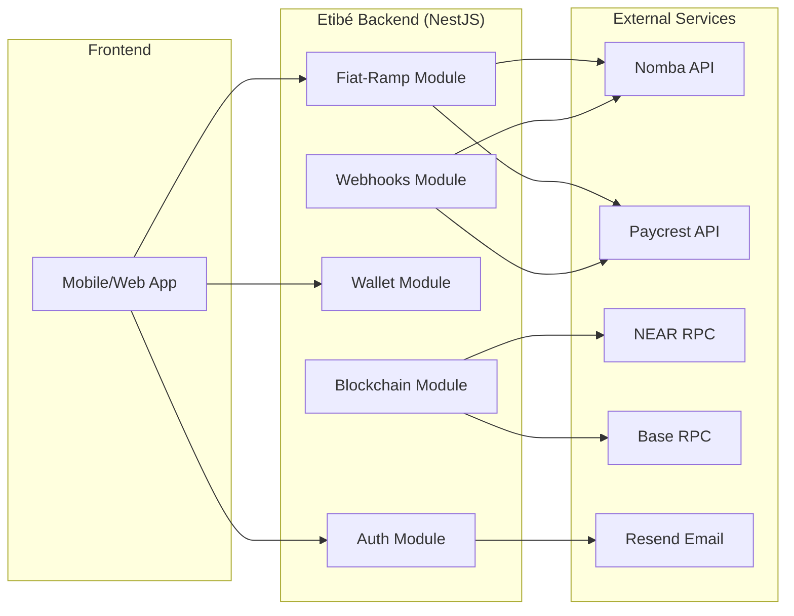
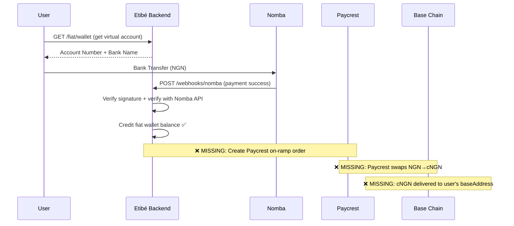
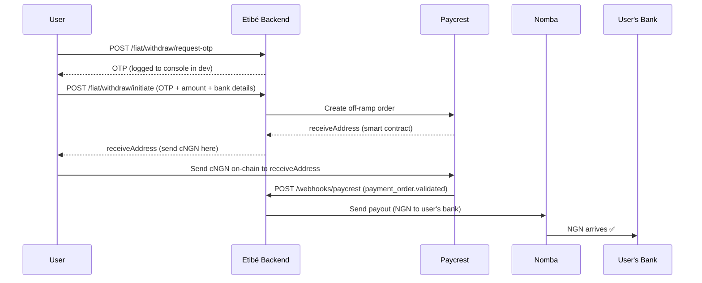

# Etibé v2 Backend — Handover Document

> **Date**: 3 July 2026  
> **Project**: [etibe_v2_backend](file:///home/ifeoluwa/etibe_v2_backend)  
> **Stack**: NestJS + TypeScript, MongoDB 7, Redis 7, Docker Compose  
> **Chains**: Base (Sepolia testnet) + NEAR (testnet)  
> **Key Integrations**: Nomba (on-ramp), Paycrest (swap/off-ramp), Resend (email)

---

## 1. Architecture Overview



### Modules

| Module | Purpose | Status |
|---|---|---|
| `auth` | Registration, login, email OTP verification, password reset, session management | ✅ Working |
| `blockchain` | NEAR & Base chain account creation, token services, vault encryption | ✅ Working |
| `circles` | Savings/social circles (Ajo/Esusu) feature | ✅ Existing (not modified) |
| `fiat-ramp` | NGN↔cNGN on-ramp/off-ramp via Nomba + Paycrest | ⚠️ Partially working |
| `mail` | (Empty module — email logic lives in `auth/services/mail.service.ts`) | — |
| `notifications` | Push/in-app notifications | ✅ Existing (not modified) |
| `transactions` | Transaction schema and history | ✅ Working |
| `users` | User schema, repositories | ✅ Working (bug fixed) |
| `wallet` | Fiat wallet (NGN ledger), crypto wallet service | ✅ Working |
| `webhooks` | Nomba & Paycrest webhook handlers | ⚠️ Implemented, untested end-to-end |

---

## 2. What Has Been Done

### 2.1 Fiat-Ramp Module (On-Ramp / Off-Ramp)

The entire fiat on-ramp and off-ramp pipeline was built from scratch across three services:

#### [NombaService](file:///home/ifeoluwa/etibe_v2_backend/src/modules/fiat-ramp/services/nomba.service.ts) — NGN Inflow
- OAuth2 token management with Redis caching (auto-refresh with 60s safety buffer)
- `getAccessToken()` — client credentials grant against Nomba sandbox
- `verifyTransaction()` — independently verifies a transaction is genuine (prevents webhook spoofing)
- `sendPayout()` — sends NGN to a user's personal bank account (used for off-ramp final step)
- All endpoints default to `https://sandboxapi.nomba.com`

#### [PaycrestService](file:///home/ifeoluwa/etibe_v2_backend/src/modules/fiat-ramp/services/paycrest.service.ts) — NGN↔cNGN Swap
- `getRate()` — fetches live cNGN/NGN sell rate on Base chain
- `createOrder()` — creates swap orders for both on-ramp (NGN→cNGN) and off-ramp (cNGN→NGN)
- `getOrder()` — check order status
- `verifyAccount()` — verify Nigerian bank account (with dev fallback mock)
- `getSupportedInstitutions()` — list supported banks

#### [FiatRampService](file:///home/ifeoluwa/etibe_v2_backend/src/modules/fiat-ramp/services/fiat-ramp.service.ts) — Orchestration
- **Fiat Wallet**: Lazy-creates user's NGN wallet with Nomba virtual account
- **Bank Accounts**: Full CRUD with Paycrest verification
- **On-Ramp Quote**: Validates min/max NGN amounts, fetches live rate, returns estimated cNGN
- **Off-Ramp Quote**: Validates min cNGN, gets live rate, returns estimated NGN
- **Off-Ramp Flow** (`initiateOffRamp`): OTP verification → balance check → rate fetch → create Paycrest order → return `receiveAddress` for frontend to send cNGN to
- **Nomba Webhook Handler** (duplicate — see blocker #3)

#### [FiatRampController](file:///home/ifeoluwa/etibe_v2_backend/src/modules/fiat-ramp/controllers/fiat-ramp.controller.ts) — API Endpoints

| Method | Route | Action |
|---|---|---|
| GET | `/fiat/wallet` | Get/create fiat wallet |
| GET | `/fiat/balance` | Get NGN balance |
| GET | `/fiat/banks` | List supported banks |
| POST | `/fiat/bank-accounts` | Add & verify bank account |
| GET | `/fiat/bank-accounts` | List saved bank accounts |
| DELETE | `/fiat/bank-accounts/:accountNumber` | Remove bank account |
| POST | `/fiat/deposit/quote` | On-ramp quote (NGN→cNGN) |
| POST | `/fiat/withdraw/quote` | Off-ramp quote (cNGN→NGN) |
| POST | `/fiat/withdraw/request-otp` | Request withdrawal OTP |
| POST | `/fiat/withdraw/initiate` | Initiate off-ramp withdrawal |

### 2.2 Webhooks Module

Built [webhooks.controller.ts](file:///home/ifeoluwa/etibe_v2_backend/src/modules/webhooks/controllers/webhooks.controller.ts) (506 lines) with two endpoints:

#### `POST /webhooks/nomba` — On-Ramp Inflow
1. Verifies HMAC-SHA256 signature (structured payload format matching Nomba's spec)
2. Independently verifies payment with Nomba API (doesn't trust webhook alone)
3. Finds user's fiat wallet by `accountReference`
4. Converts kobo → NGN
5. Records **double-entry ledger** (DEBIT asset, CREDIT liability)
6. Emits `DEPOSIT_CONFIRMED` event

#### `POST /webhooks/paycrest` — Swap Settlement & Off-Ramp
Handles 4 event types:
- `payment_order.settled` → On-ramp complete: cNGN delivered to user's Base wallet
- `payment_order.validated` → Off-ramp: calls `nombaService.sendPayout()` to forward NGN to user's bank
- `payment_order.refunded` → Marks transaction as REVERSED
- `payment_order.expired` → Marks transaction as EXPIRED

Both use timing-safe HMAC verification and proper idempotency guards.

### 2.3 Wallet Module

#### [FiatWalletService](file:///home/ifeoluwa/etibe_v2_backend/src/modules/wallet/services/fiat-wallet.service.ts)
- `getOrCreateFiatWallet()` — lazy-creates NGN wallet with mock Nomba virtual account
- `getFiatBalance()` — returns cached fiat balance
- `recordLedgerTransaction()` — double-entry accounting with ASSET/LIABILITY postings
- `findByVirtualAccountNumber()` / `findByAccountReference()` — wallet lookups for webhooks

#### [FiatWallet Schema](file:///home/ifeoluwa/etibe_v2_backend/src/modules/wallet/schemas/fiat-wallet.schema.ts)
- `userId`, `currency` (NGN), `balance` (Decimal128), `virtualAccount` (embedded), `status`
- Indexed on `{userId, currency}` (unique), `virtualAccount.accountNumber`, `virtualAccount.accountReference`

### 2.4 Bug Fixes Applied

| Bug | Root Cause | Fix |
|---|---|---|
| `MONGO_DUPLICATE_KEY` error on registration (`email: null`) | A ghost document with no email existed in the `users` collection from before validation was added | Deleted the corrupt document directly from MongoDB |
| All user fields saving as `undefined` (email, username, firstName, etc.) | The `@Schema()` decorator in [user.schema.ts](file:///home/ifeoluwa/etibe_v2_backend/src/modules/users/schemas/user.schema.ts) was accidentally placed on the `BankDetail` class instead of the `User` class. Mongoose was stripping all fields. | Moved `@Schema({ _id: false })` to `BankDetail` and the full `@Schema({ collection, timestamps })` to `User` |
| Duplicate NestJS route crash (`/webhooks/nomba`) | A separate `NombaWebhookController` existed in the `fiat-ramp` module AND the logic was also in `webhooks.controller.ts` | Deleted the duplicate controller, removed it from `fiat-ramp.module.ts` |
| Docker network error on restart | IPv6 option changed, Docker network needed recreation | Ran `docker-compose down && docker-compose up -d` |
| OTP emails not sending in local dev | Resend API key may not be verified for the domain, or network issues from host machine | Added dev-mode OTP console logging (`🔑 DEVELOPMENT OTP FOR ...`) in [mail.service.ts](file:///home/ifeoluwa/etibe_v2_backend/src/modules/auth/services/mail.service.ts) |

### 2.5 Development Workflow Improvement

Previously, every code change required a full `docker-compose up -d --build api` (~3 min). Switched to running the NestJS app natively with `pnpm run start:dev` while keeping only MongoDB and Redis in Docker:

```bash
docker-compose up -d mongo redis
pnpm run start:dev
```

This gives instant hot-reload on code changes.

---

## 3. Current Blockers

> [!CAUTION]
> These are the items that are blocking the fiat on-ramp/off-ramp from working end-to-end.

### Blocker 1: Virtual Account Numbers Are Mock/Random

**Severity**: 🔴 Critical

The [FiatWalletService.getOrCreateFiatWallet()](file:///home/ifeoluwa/etibe_v2_backend/src/modules/wallet/services/fiat-wallet.service.ts#L38-L82) method generates **random fake account numbers** instead of calling the Nomba API to create real virtual accounts:

```typescript
// Current (mock):
const mockVirtualAccount = {
  accountReference,
  bankName: "Wema Bank",
  accountNumber: Math.floor(1000000000 + Math.random() * 9000000000).toString(),
  accountName: `ETIBE/${user.firstName} ${user.lastName}`,
};
```

**What needs to happen**: Replace this with a real call to `NombaService.createVirtualAccount()` which calls `POST /v1/accounts/virtual-accounts/create` on the Nomba API. This method needs to be created in `NombaService`.

**Impact**: Without real virtual accounts, users cannot deposit NGN via bank transfer, and the Nomba webhook will never fire because the account numbers don't exist in Nomba's system.

---

### Blocker 2: No NGN → cNGN Conversion After Deposit

**Severity**: 🟡 High

When the Nomba webhook confirms a deposit, the system currently **only credits the internal NGN fiat wallet balance**. It does NOT convert that NGN into cNGN tokens on the Base blockchain.

The intended flow is:
1. ✅ User deposits NGN → Nomba webhook fires → fiat wallet balance credited
2. ❌ **Missing**: System should call Paycrest to create an on-ramp order (NGN→cNGN), which would swap the NGN for cNGN and send it to the user's `baseAddress`

**Options to implement**:
- **Option A (Paycrest On-Ramp)**: After crediting fiat balance, call `PaycrestService.createOrder()` with source=fiat/NGN and destination=crypto/cNGN targeting the user's `baseAddress`. Then use Nomba to pay NGN into Paycrest's bank account.
- **Option B (Direct Transfer)**: If the platform's master wallet already holds cNGN, transfer cNGN directly from master wallet to user's `baseAddress` using `BaseAccountService.executeErc20Transfer()`.

---

### Blocker 3: Duplicate Webhook Logic

**Severity**: 🟡 Medium

There are **two separate Nomba webhook handlers** that do slightly different things:

1. [webhooks.controller.ts](file:///home/ifeoluwa/etibe_v2_backend/src/modules/webhooks/controllers/webhooks.controller.ts#L64-L200) — Full implementation with HMAC verification, Nomba API verification, double-entry ledger. Looks up wallet by `accountReference`.
2. [fiat-ramp.service.ts](file:///home/ifeoluwa/etibe_v2_backend/src/modules/fiat-ramp/services/fiat-ramp.service.ts#L369-L426) — Simpler version that directly credits the wallet balance. Looks up wallet by `accountNumber`.

**What needs to happen**: Decide which one is canonical, remove the other, and ensure the remaining one handles all cases. The `webhooks.controller.ts` version is more complete (has signature verification, Nomba API verification, ledger entries).

---

### Blocker 4: Withdrawal OTP Email Not Wired

**Severity**: 🟢 Low

The `requestWithdrawalOtp()` method in [fiat-ramp.service.ts](file:///home/ifeoluwa/etibe_v2_backend/src/modules/fiat-ramp/services/fiat-ramp.service.ts#L200) has a TODO:

```typescript
// TODO: integrate MailService to send OTP email (same pattern as wallet.service.ts)
this.logger.log(`[FIAT RAMP] Withdrawal OTP generated for user ${userId} — OTP: ${otp} (dev only)`);
```

The OTP is generated and stored in Redis, but it's only logged to the console. For production, it needs to be emailed via the `MailService`.

---

### Blocker 5: Nomba API Endpoints Unverified

**Severity**: 🟡 Medium

Multiple methods in [nomba.service.ts](file:///home/ifeoluwa/etibe_v2_backend/src/modules/fiat-ramp/services/nomba.service.ts) have ⚠️ warnings like:

```typescript
// ⚠️ Verify exact path in Nomba docs
```

The following endpoints need verification against the [Nomba developer docs](https://developer.nomba.com):
- `POST /auth/token/issue` — OAuth token issuance
- `GET /v1/transactions/accounts/single?transactionId=...` — Transaction verification
- `POST /v1/accounts/transfer` — Payout to bank account
- HMAC signature format in `webhooks.controller.ts`

---

## 4. Infrastructure Status

| Component | Status | Notes |
|---|---|---|
| MongoDB 7 | ✅ Running (`etibe-mongo`) | Database was dropped clean on 29 June. Fresh state. |
| Redis 7 | ✅ Running (`etibe-redis`) | Used for session store, OTP cache, Nomba token cache |
| NestJS API | ✅ Running locally | Via `pnpm run start:dev` with hot-reload |
| Nomba (Sandbox) | ⚠️ Keys configured | `NOMBA_CLIENT_ID`, `NOMBA_CLIENT_SECRET`, `NOMBA_ACCOUNT_ID` set in `.env` |
| Paycrest | ⚠️ Keys configured | `PAYCREST_API_KEY`, `PAYCREST_PARTNER_ID` set in `.env` |
| Resend | ⚠️ Key configured | `RESEND_API_KEY` set, but emails may not deliver (domain verification unclear). Dev OTP logging added as workaround. |
| NEAR (testnet) | ✅ Configured | Master account: `etibe.testnet` |
| Base (Sepolia) | ✅ Configured | Master wallet private key set. `BASE_PAYOUT_CONTRACT_ADDRESS` is still placeholder (`<after-you-deploy>`) |
| ngrok | ❌ Not running | Needed for webhook testing. Must be started manually: `ngrok http 3000` |

---

## 5. Money Flow Diagrams

### On-Ramp (NGN → cNGN) — Current State



### Off-Ramp (cNGN → NGN) — Implemented



---

## 6. Environment Variables Reference

The `.env` file at project root contains all keys. Key services:

| Variable | Service | Has Real Value? |
|---|---|---|
| `RESEND_API_KEY` | Email (Resend) | ✅ Yes |
| `NOMBA_CLIENT_ID` | Nomba sandbox | ✅ Yes |
| `NOMBA_CLIENT_SECRET` | Nomba sandbox | ✅ Yes |
| `NOMBA_ACCOUNT_ID` | Nomba sandbox | ✅ Yes |
| `NOMBA_WEBHOOK_SECRET` | Nomba webhook HMAC | ✅ Yes |
| `PAYCREST_API_KEY` | Paycrest | ✅ Yes |
| `PAYCREST_PARTNER_ID` | Paycrest | ✅ Yes |
| `NEAR_MASTER_PRIVATE_KEY` | NEAR testnet | ✅ Yes |
| `BASE_MASTER_PRIVATE_KEY` | Base Sepolia | ✅ Yes |
| `MASTER_ENCRYPTION_KEY` | Vault (AES-256-GCM) | ✅ Yes |
| `BASE_PAYOUT_CONTRACT_ADDRESS` | Circle payout contract | ❌ Placeholder |

---

## 7. Recommended Next Steps (Priority Order)

1. **Create real Nomba virtual accounts** — Add `createVirtualAccount()` to `NombaService`, replace mock in `FiatWalletService`
2. **Implement NGN→cNGN conversion** — After deposit webhook, trigger Paycrest on-ramp order + fund it via Nomba
3. **Consolidate webhook handlers** — Remove duplicate handler in `fiat-ramp.service.ts`, keep the one in `webhooks.controller.ts`
4. **Verify Nomba API endpoints** — Cross-reference all paths with [developer.nomba.com](https://developer.nomba.com)
5. **Wire withdrawal OTP email** — Connect `requestWithdrawalOtp()` to `MailService`
6. **Deploy Base payout contract** — Set `BASE_PAYOUT_CONTRACT_ADDRESS` in `.env`
7. **Set up ngrok for webhook testing** — Run `ngrok http 3000` and register the URL in Nomba sandbox dashboard
8. **Remove Paycrest mock fallback** — The `verifyAccount()` dev mock needs to be removed before production

---

## 8. How to Run Locally

```bash
# Start infrastructure
cd ~/etibe_v2_backend
docker-compose up -d mongo redis

# Start API with hot-reload
pnpm run start:dev

# (Optional) Start ngrok for webhook testing
ngrok http 3000
```

> [!TIP]
> In development mode, OTP codes are printed directly to the terminal as:
> ```
> 🔑 DEVELOPMENT OTP FOR user@email.com: 123456
> ```
> Use this code for email verification instead of checking your inbox.
