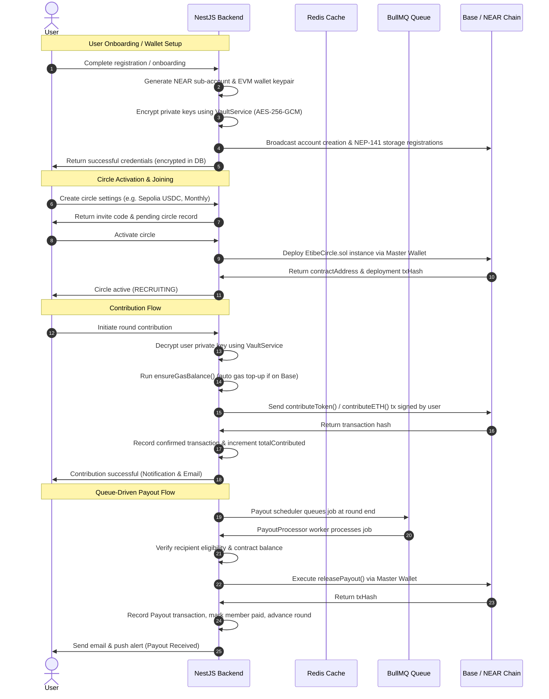

# Etibé Backend Codebase Map

This document provides a comprehensive structural and functional map of the Etibé backend codebase. Etibé is an enterprise-grade rotating savings and credit association (ROSCA) API built using NestJS, Fastify, MongoDB (Mongoose), and Redis, supporting savings circles on both the **Base (EVM) Chain** and the **NEAR Protocol**.

---

## 📁 Directory Structure

Below is the directory tree for the backend source and smart contracts:

```
etibe-backend/
├── contracts/                  # Solidity smart contracts (Base Chain)
│   └── EtibeCircle.sol         # Core ROSCA circle logic on EVM
├── scripts/                    # Deployment and utility scripts
│   └── copy-abi.ts             # Hardhat compiled ABI copier utility
├── src/                        # NestJS backend application source
│   ├── app.module.ts           # Root application module
│   ├── main.ts                 # Fastify adapter bootstrap script
│   ├── config/                 # Environment validation and configurations
│   │   ├── app.config.ts       # Namespaced configurations (database, redis, near, base, etc.)
│   │   └── env.validation.ts   # Startup schema validator for .env values
│   ├── core/                   # Global filters, interceptors, guards, and services
│   │   ├── decorators/         # Custom decorators (e.g., SkipResponseTransform, Public)
│   │   ├── filters/            # Global exception filters
│   │   ├── guards/             # Auth guards (session validation, user validation)
│   │   ├── interceptors/       # Request/Response interceptors
│   │   ├── middleware/         # Security (XSS protection, request ID) middleware
│   │   ├── pipes/              # ParseObjectId validation pipe
│   │   ├── repositories/       # Mongoose generic BaseRepository pattern
│   │   └── services/           # Redis connection service
│   ├── modules/                # Feature-specific modules
│   │   ├── auth/               # Authentication & Session Management
│   │   ├── blockchain/         # Web3 Layer (Base, NEAR & Cryptographic Vault)
│   │   ├── circles/            # ROSCA Circles lifecycle, member management & payout scheduler
│   │   ├── mail/               # Email integrations (via Resend)
│   │   ├── notifications/      # In-app notification management
│   │   ├── transactions/       # Financial transaction ledger
│   │   ├── users/              # User profiles and database schemas
│   │   ├── utilities/          # Cloudinary media uploads
│   │   └── wallet/             # Non-custodial wallets & queue-driven withdrawals
│   └── shared/                 # Common enums, constants, types, and utils
```

---

## 🔐 Core Services & Utility Modules

### 1. Cryptographic Key Custody (`VaultService`)

- **Path**: [vault.service.ts](https://github.com/dolphlabs/etibe_v2_backend/src/modules/blockchain/services/vault.service.ts)
- **Purpose**: Performs client-side encryption and decryption of blockchain private keys. It ensures that user private keys (both NEAR and Base) are never stored in plaintext within the MongoDB database.
- **Key Functions**:
  - `encrypt(plaintext)` / `decrypt(encryptedData)`: Utilizes **AES-256-GCM** with a derived key (scrypt key derivation from the `MASTER_ENCRYPTION_KEY` and a randomized salt).
  - `encryptPrivateKey(privateKey)` / `decryptPrivateKey(encryptedData)`: Wrappers for secure key handling.
  - `generateSecureOtp(length)`: Secure random OTP generator used for validating withdrawals.
  - `hashForRateLimit(identifier)`: Fast rate-limit hashing.

### 2. Base Chain Integrations (`BaseAccountService` & `BaseTokenService`)

- **Path**: [base-account.service.ts](https://github.com/dolphlabs/etibe_v2_backend/src/modules/blockchain/services/base-account.service.ts) & [base-token.service.ts](https://github.com/dolphlabs/etibe_v2_backend/src/modules/blockchain/services/base-token.service.ts)
- **Purpose**: Coordinates EVM operations on the Base network (Sepolia/Mainnet) using the `ethers` library.
- **Key Functions**:
  - `generateKeyPair()`: Generates standard EVM credentials.
  - `createAccount(username)`: Generates and returns encrypted private key credentials for user registration.
  - `fundAccount(address, amountEth)`: Sends native ETH from the master wallet (payout/funding source) to a target address.
  - `getWalletBalances(address)`: Queries native ETH, cNGN, and USDC balances.
  - `deployCircleContract(...)`: Compiles and deploys a new instance of `EtibeCircle.sol` on Base.
  - `addMemberToContract(circleAddress, memberAddress, position)`: Adds a participant to the deployed smart contract.
  - `executeContribution(...)`: User-signed ERC-20 token approval and contribution call to `EtibeCircle`.
  - `releasePayout(circleAddress)`: Releases the round's collected balance to the recipient.
  - `ensureGasBalance(userAddress)`: **Crucial UX Feature.** Automatically tops up user wallets with native ETH from the master wallet if their balance falls below `0.0005 ETH`, removing gas fee friction.

### 3. NEAR Protocol Integrations (`NearAccountService`, `NearService` & `TokenService`)

- **Path**: [near-account.service.ts](https://github.com/dolphlabs/etibe_v2_backend/src/modules/blockchain/services/near-account.service.ts) & [near.service.ts](https://github.com/dolphlabs/etibe_v2_backend/src/modules/blockchain/services/near.service.ts)
- **Purpose**: Interacts with the NEAR Protocol using `near-api-js`.
- **Key Functions**:
  - `createSubAccount(username, initialBalanceNear)`: Creates a sub-account of the master account (e.g. `user.etibe.testnet`) and assigns it a generated public key.
  - `registerWithTokenContracts(accountId)`: Automatically registers the new NEAR account with the NEP-141 token contracts (USDT and USDC) to allow storage allocation.
  - `executeContribution(...)`: Signs and sends transactions to NEAR.
  - `deployCircleContract(...)`: Handles contract initialization on NEAR.

### 4. ROSCA Core Logic (`CircleService` & `PayoutProcessor`)

- **Path**: [circle.service.ts](https://github.com/dolphlabs/etibe_v2_backend/src/modules/circles/services/circle.service.ts) & [payout.processor.ts](https://github.com/dolphlabs/etibe_v2_backend/src/modules/circles/processors/payout.processor.ts)
- **Purpose**: Manages ROSCA cycle creation, recruitment, and round-advancement loops. Payout execution is queue-driven via BullMQ to avoid front-running or transaction congestion.
- **Key Functions**:
  - `createCircle(creatorId, dto)`: Configures settings (target chain, amount, currency, payout frequency, max members) and registers the circle model.
  - `activateCircle(circleId, userId)`: Triggers on-chain deployment of the contract and moves status from `PENDING` to `RECRUITING`.
  - `joinCircle(userId, userNearAccountId, dto)`: Validates spaces, appends members locally and on-chain, and tracks slots.
  - `makeContribution(circleId, userId)`: Decrypts private keys, runs the on-chain transfer, updates total contributed metrics, and sends confirmation emails.
  - `PayoutProcessor.process(job)`: Worker consumer that validates a round's progress, executes `releasePayout()` on-chain, advances the round number, and triggers alerts/notifications upon failure.

### 5. Non-Custodial Withdrawals (`WalletService` & `WithdrawalProcessor`)

- **Path**: [wallet.service.ts](https://github.com/dolphlabs/etibe_v2_backend/src/modules/wallet/services/wallet.service.ts) & [withdrawal.processor.ts](https://github.com/dolphlabs/etibe_v2_backend/src/modules/wallet/processors/withdrawal.processor.ts)
- **Purpose**: Enables users to withdraw funds from their managed wallets to outer addresses. Protected by OTP email checks and queue-throttled worker execution.
- **Key Functions**:
  - `requestWithdrawalOtp(userId, deviceId, asset, amount, chain)`: Validates request details, saves a 6-digit OTP in cache for 5 minutes, and emails it.
  - `processWithdrawal(userId, deviceId, dto, idempotencyKey)`: Verifies OTP, checks balances, creates a `PENDING` transaction in MongoDB, and queues a BullMQ job.
  - `WithdrawalProcessor.process(job)`: Decrypts the user private key, executes the EVM (ETH/ERC20) or NEAR transfer on-chain, and transitions the database transaction from `PENDING` to `CONFIRMED`.

---

## 📜 Base Chain Smart Contract (`EtibeCircle.sol`)

- **Path**: [EtibeCircle.sol](https://github.com/dolphlabs/etibe_v2_backend/contracts/EtibeCircle.sol)
- **Design**:
  - The contract owner is the backend's master wallet.
  - Supports native ETH (`tokenAddress == address(0)`) or any ERC-20 token (e.g. cNGN, USDC).
  - Members are added by the owner matching their positions.
  - Once started (`isActive = true`), members contribute precisely the `contributionAmount` once per round.
  - The contract owner invokes `releasePayout()`, which queries the scheduled recipient in the `payoutOrder` list, calculates the total collected pool (`contributionAmount * memberList.length`), transfers the funds, and advances the round.
  - Features an `emergencyWithdraw()` function for administrative asset protection.

---

## 💾 Database Models (Mongoose)

### 1. User

- **Path**: [user.schema.ts](https://github.com/dolphlabs/etibe_v2_backend/src/modules/users/schemas/user.schema.ts)
- **Fields**:
  - Identity: `email`, `username`, `firstName`, `lastName`, `password`, `phone`, `avatar`
  - NEAR credentials: `nearAccountId`, `nearPublicKey`, `nearEncryptedPrivateKey` (AES encrypted)
  - Base credentials: `baseAddress`, `basePublicKey`, `baseEncryptedPrivateKey` (AES encrypted)
  - Preferences & States: `preferredChain` ("BASE" or "NEAR"), `walletBalance`, `isActive`, `isEmailVerified`, `onboardingCompleted`

### 2. Circle

- **Path**: [circle.schema.ts](https://github.com/dolphlabs/etibe_v2_backend/src/modules/circles/schemas/circle.schema.ts)
- **Fields**:
  - Metadata: `name`, `description`, `logoUrl`, `creatorId`
  - Configurations: `chain` ("BASE" or "NEAR"), `contributionSettings` (amount, currency, frequency, gracePeriodDays, penaltyPercentage), `maxMembers`, `isPrivate`
  - Status & Rounds: `status` (PENDING, RECRUITING, ACTIVE, COMPLETED, CANCELLED), `currentRound`, `totalRounds`, `startDate`, `endDate`, `nextPayoutDate`
  - Blockchain: `contractAddress`, `inviteCode`, `inviteLink`
  - Sub-documents: `members` (Array of Member: `userId`, `position`, `hasReceivedPayout`, `payoutDate`, `payoutTransactionHash`, `joinedAt`, `status`)

### 3. Transaction

- **Path**: [transaction.schema.ts](https://github.com/dolphlabs/etibe_v2_backend/src/modules/transactions/schemas/transaction.schema.ts)
- **Fields**:
  - Type: `type` (TOP_UP, CONTRIBUTION, PAYOUT, WITHDRAWAL, PENALTY, REFUND, JOINED_CHANNEL)
  - State: `status` (PENDING, CONFIRMED, FAILED, REVERSED, COMPLETED), `failureReason`
  - Accounts: `userId`, `circleId`, `nearAccountId`, `baseAddress`
  - Ledger: `amount`, `currency`, `chain`, `round`, `transactionHash`, `confirmedAt`

---

## 🔄 Core Web3 Workflows


